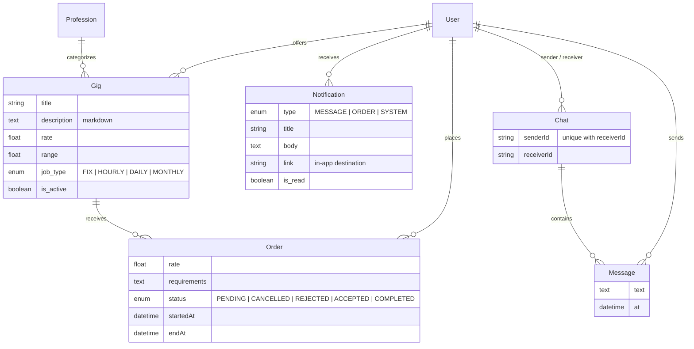

# Ustad

A peer-to-peer gig marketplace that connects customers with skilled local
tradespeople — *ustads* — with built-in real-time chat and notifications.

## The problem

Finding a trustworthy electrician, plumber, or mechanic usually happens through
word of mouth. Skilled workers have no simple way to advertise their services,
and customers have no simple way to compare rates, place a work request, and
talk to the person who will do the job — negotiation happens off-platform over
phone calls, and nothing is tracked.

## The solution

Ustad puts the whole flow in one app:

1. **Ustads publish gigs** — a service with a title, markdown description,
   rate, job type (fixed / hourly / daily / monthly), coverage range, and
   profession category.
2. **Customers browse and order** — filter gigs by profession, paginate, and
   place an order with their requirements and offered rate.
3. **Both sides negotiate over live chat** — Socket.IO-backed messaging with
   typing indicators, online presence, and delivery acks.
4. **Order lifecycle is tracked** — `PENDING → ACCEPTED / REJECTED /
   CANCELLED → COMPLETED`, with each transition notifying the other party.
5. **Nothing gets missed** — notifications persist in Postgres and push live
   to a bell in the navigation; unread messages collapse into one alert per
   conversation.

## Tech stack

| Layer      | Technology                                                        |
| ---------- | ----------------------------------------------------------------- |
| Framework  | Next.js 16 (App Router, Turbopack), React 19, TypeScript 5.9      |
| Server     | Custom Node server (`server.ts`, run with `tsx`) + Socket.IO 4.8  |
| Database   | PostgreSQL via Prisma ORM 7 (`prisma-client` generator, `@prisma/adapter-pg`) |
| Auth       | NextAuth v4 with Google OAuth (JWT session strategy)              |
| UI         | Radix Themes 3, Tailwind CSS 4, daisyUI 5                         |
| Data/forms | TanStack React Query 5, React Hook Form 7, Zod 4                  |
| Realtime   | Socket.IO (server + client) on the same HTTP server as Next       |

## Architecture

```
                ┌──────────────────────────────────────────────┐
                │   server.ts  (one Node process, one port)    │
                │                                              │
  browser ──────┤  Next.js handler        Socket.IO server     │
   HTTP         │  ├─ pages (RSC)         ├─ JWT cookie auth   │
   WebSocket ───┤  ├─ API routes ────────►│  (io middleware)   │
                │  │   globalThis.io      ├─ user:<id> rooms   │
                │  └─ proxy.ts (auth)     └─ chat:<id> rooms   │
                │            │                   │             │
                │            └────► Prisma 7 ◄───┘             │
                │              (pg driver adapter)             │
                └──────────────────┬───────────────────────────┘
                                   │
                              PostgreSQL
```

Key decisions:

- **One process, one port.** `server.ts` boots Next and attaches Socket.IO to
  the same HTTP server — no CORS, no second deployment. Because API routes run
  in this process, they push real-time events through `globalThis.io`
  (see `app/lib/notifications.ts`).
- **Sockets are authenticated.** The Socket.IO middleware verifies the
  NextAuth JWT session cookie with `next-auth/jwt` before a connection is
  accepted; the session strategy is JWT, so no database round-trip is needed.
- **Rooms model.** Every connection joins its personal `user:<userId>` room
  (notifications, chat-list refresh, presence). Opening a conversation joins
  `chat:<chatId>` after a participant check.
- **Messages persist first, then fan out.** `message:send` writes through
  Prisma, then acks the sender and emits `message:new` to the room. A
  recipient who doesn't have the chat open gets a persistent notification
  instead — consecutive messages collapse into one unread alert.
- **Route protection.** `proxy.ts` (Next 16's middleware) wraps protected
  routes with `next-auth/middleware`, redirecting anonymous visitors to
  Google sign-in.
- **Browser-safe Prisma imports.** `prisma/client.ts` (instance + pg adapter)
  is server-only; components import model types and enums from
  `prisma/models.ts`, which re-exports the generated browser entry so the pg
  driver never lands in client bundles.

### Socket events

| Event             | Direction       | Purpose                                        |
| ----------------- | --------------- | ---------------------------------------------- |
| `chat:join/leave` | client → server | Enter/exit a conversation room (with ack)      |
| `message:send`    | client → server | Persist + deliver a message (ack carries it)   |
| `message:new`     | server → room   | Live message for everyone else in the chat     |
| `chat:typing`     | both            | Typing indicator relay                         |
| `chats:updated`   | server → users  | Refresh the chat list after any new message    |
| `presence:update` | server → all    | Online/offline status changes                  |
| `notification:new`| server → user   | Live notification (message, order, or system)  |

## Data models



`User`, `Account`, `Session`, and `VerificationToken` follow the standard
NextAuth Prisma schema. A `Chat` is unique per user pair; a `Notification`
belongs to its recipient and deep-links to the chat or order that raised it.

## File structure

```
ustad/
├── server.ts               # Custom server: Next + Socket.IO + notifications
├── proxy.ts                # Route protection (Next 16 middleware)
├── prisma.config.ts        # Prisma CLI config (datasource URL, migrations)
├── compose.yml             # Local PostgreSQL (host port 5433)
├── prisma/
│   ├── schema.prisma       # Models (generator: prisma-client → ./generated)
│   ├── client.ts           # Server-only PrismaClient + pg adapter singleton
│   ├── models.ts           # Browser-safe types/enums re-export
│   └── migrations/
└── app/
    ├── layout.tsx          # Root layout: providers, header, bottom nav
    ├── page.tsx            # Home: gig browsing (filter + pagination)
    ├── NavBtm.tsx          # Bottom dock: Home, Orders, Chats, Alerts, Profile
    ├── validationSchemas.ts# Zod schemas shared by forms and API routes
    ├── auth/               # NextAuth options, session provider, types
    ├── components/         # Logo, Skeleton, Spinner, NotificationBadge, …
    ├── lib/notifications.ts# notify(): persist + push via globalThis.io
    ├── api/
    │   ├── auth/[...nextauth]/
    │   ├── gigs/           # CRUD + nested orders creation
    │   ├── orders/[id]/    # Order updates (status changes notify)
    │   ├── chats/          # Find-or-create a conversation
    │   └── notifications/  # List + unread count, mark-all-read
    ├── gigs/               # Gig pages: detail, new, edit (+ _components)
    ├── orders/             # Order pages: list, detail (+ _components)
    ├── chats/              # Chat list + live chat room (+ socket client)
    ├── notifications/      # Notification center page
    └── profile/
```

## Getting started

Prerequisites: Node 20.9+, Docker, a Google OAuth client
([console.cloud.google.com](https://console.cloud.google.com) →
credentials → OAuth client ID, redirect URI
`http://localhost:3000/api/auth/callback/google`).

```bash
# 1. Install dependencies (also generates the Prisma client)
npm install

# 2. Start PostgreSQL
docker compose up -d

# 3. Configure environment
cp .env.example .env
# fill in NEXTAUTH_SECRET (openssl rand -base64 32) and Google credentials

# 4. Apply database migrations
npx prisma migrate deploy

# 5. Run (custom server: Next + Socket.IO on :3000)
npm run dev
```

| Script          | What it does                                    |
| --------------- | ----------------------------------------------- |
| `npm run dev`   | Dev server via `tsx server.ts`                  |
| `npm run build` | Production build (Turbopack)                    |
| `npm start`     | Production server via `tsx server.ts`           |
| `npm run lint`  | ESLint (flat config)                            |

> **Deployment note:** chat and notifications need a long-lived Node process
> for the Socket.IO server — deploy to a VPS/container platform (Railway,
> Fly.io, a Docker host, …), not a serverless-only target.

## License

[Mozilla Public License 2.0](LICENSE)
